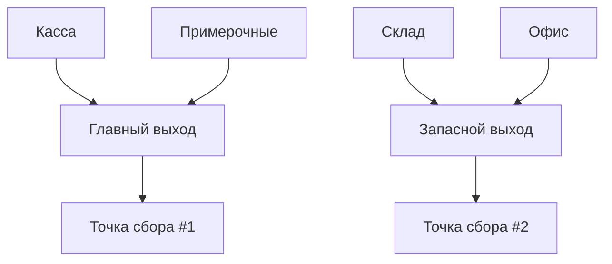

## Добро пожаловать в команду!


  


Мы рады приветствовать вас в нашей команде! Это руководство поможет вам быстро освоиться и стать эффективным сотрудником нашего магазина.

<Note>
Обязательно ознакомьтесь со всеми разделами этого руководства в течение первой недели работы.
</Note>

## Основные обязанности

### Обслуживание клиентов

<Steps>
  <Step title="Приветствие клиентов">
    Встречайте каждого клиента с улыбкой и приветствием: "Добро пожаловать в наш магазин! Чем я могу вам помочь сегодня?"
  </Step>
  <Step title="Консультирование">
    Будьте готовы ответить на вопросы о товарах. Если вы не знаете ответ, скажите: "Отличный вопрос! Позвольте мне уточнить эту информацию для вас" и обратитесь к старшему сотруднику.
  </Step>
  <Step title="Завершение обслуживания">
    Всегда благодарите клиентов за посещение: "Спасибо за покупку! Будем рады видеть вас снова!"
  </Step>
</Steps>

### Работа с кассой

Помните, что точность и внимательность при работе с кассой являются критически важными. Каждая транзакция должна быть оформлена правильно, и любые расхождения в кассе должны быть немедленно доложены руководству. Никогда не допускайте, чтобы кто-либо кроме вас использовал вашу учетную запись кассира.

```bash Последовательность действий
# Открытие кассы (начало смены)
1. Введите свой ID сотрудника
2. Введите пароль
3. Выберите "Открыть кассу"
4. Пересчитайте начальную сумму
5. Подтвердите сумму в системе

# Закрытие кассы (конец смены)
1. Выберите "Закрыть кассу"
2. Пересчитайте наличные
3. Введите итоговую сумму
4. Проверьте отчет о продажах
5. Подтвердите закрытие
```

<Tabs>
  <Tab title="Наличные платежи">
    1. Объявите клиенту итоговую сумму
    2. Примите деньги, держа их на виду
    3. Введите полученную сумму в кассу
    4. Выдайте сдачу вместе с чеком
    5. Поблагодарите клиента
  </Tab>
  <Tab title="Карточные платежи">
    1. Объявите итоговую сумму
    2. Предложите клиенту использовать терминал
    3. Дождитесь подтверждения платежа
    4. Выдайте чек
    5. Поблагодарите клиента
  </Tab>
  <Tab title="Возвраты">
    1. Попросите чек и товар
    2. Проверьте состояние товара
    3. Выберите "Возврат" в системе
    4. Введите номер чека или найдите транзакцию
    5. Выполните возврат согласно способу оплаты
    6. Выдайте чек о возврате
  </Tab>
</Tabs>

## Правила магазина

Соблюдение правил магазина является обязательным для всех сотрудников. Эти правила разработаны для обеспечения комфортной работы, безопасности и высоких стандартов обслуживания клиентов. Нарушение правил может привести к дисциплинарным взысканиям вплоть до увольнения. Если у вас возникли вопросы по любому из правил, обратитесь к вашему руководителю или в отдел кадров.

### Рабочий график

<table>
  <thead>
    <tr>
      <th>Смена</th>
      <th>Начало</th>
      <th>Конец</th>
      <th>Перерыв</th>
    </tr>
  </thead>
  <tbody>
    <tr>
      <td>Утренняя</td>
      <td>8:00</td>
      <td>16:00</td>
      <td>12:00-12:30</td>
    </tr>
    <tr>
      <td>Дневная</td>
      <td>12:00</td>
      <td>20:00</td>
      <td>16:00-16:30</td>
    </tr>
    <tr>
      <td>Вечерняя</td>
      <td>16:00</td>
      <td>00:00</td>
      <td>20:00-20:30</td>
    </tr>
  </tbody>
</table>

### Дресс-код

<CardGroup cols={2}>
  <Card title="Стандартная форма" icon="shirt">
    - Фирменная рубашка/блузка с логотипом
    - Черные брюки или юбка
    - Закрытая обувь черного цвета
    - Именной бейдж (всегда на видном месте)
  </Card>
  <Card title="Запрещено" icon="ban">
    - Спортивная одежда
    - Джинсы с разрывами
    - Открытая обувь
    - Крупные украшения
    - Яркий макияж
  </Card>
</CardGroup>

## Безопасность

<Warning>
В случае чрезвычайной ситуации (пожар, угроза безопасности) немедленно звоните по внутреннему номеру 911 или используйте тревожную кнопку.
</Warning>

Безопасность наших сотрудников и клиентов является абсолютным приоритетом для компании. Каждый сотрудник должен быть знаком с протоколами безопасности и готов действовать в соответствии с ними в любой момент. Регулярно проверяйте состояние аварийного оборудования и знайте расположение всех выходов.

### План эвакуации



### Действия при чрезвычайных ситуациях

В нашем магазине могут возникнуть различные чрезвычайные ситуации, требующие быстрой и правильной реакции. Каждый сотрудник обязан знать, как действовать в каждом из сценариев, описанных ниже. Ежеквартально мы проводим тренировки по отработке этих сценариев, и ваше участие в них обязательно. Помните - от ваших действий может зависеть безопасность коллег и покупателей!

<Accordion title="Пожар">
  1. Сохраняйте спокойствие
  2. Активируйте ближайшую пожарную сигнализацию
  3. Звоните по внутреннему номеру 911
  4. Помогите посетителям эвакуироваться
  5. Используйте огнетушитель только при небольшом возгорании
  6. Двигайтесь к ближайшему выходу
  7. Соберитесь в назначенной точке сбора
</Accordion>

<Accordion title="Медицинская помощь">
  1. Оцените состояние пострадавшего
  2. Вызовите помощь по внутреннему номеру 922
  3. Сообщите о местоположении и характере травмы
  4. Оставайтесь с пострадавшим до прибытия помощи
  5. Используйте аптечку первой помощи при необходимости
</Accordion>

<Accordion title="Подозрительное поведение/кража">
  1. Не пытайтесь остановить подозреваемого самостоятельно
  2. Дискретно сообщите охране, используя код "10-20"
  3. Запомните внешний вид и направление движения подозреваемого
  4. Заполните отчет об инциденте
</Accordion>

## Работа с товаром

Эффективное управление товаром - это основа успешной работы нашего магазина. Правильное хранение, учет и представление товаров не только обеспечивает хороший клиентский опыт, но и минимизирует потери. Каждый сотрудник должен знать основные принципы работы с товаром и следовать установленным процедурам.

### Приемка товара

Для правильной приемки товара следуйте этим основным шагам:
1. Проверьте накладную и сверьте с фактической поставкой
2. Проверьте целостность упаковки всех товаров
3. Отсканируйте каждый товар в систему учета
4. Размещайте товар на складе согласно утвержденной планограмме
5. Отметьте в системе завершение приемки и подпишите необходимые документы

### Инвентаризация

<Frame>
  
</Frame>

Инвентаризация проводится каждый месяц. Используйте переносной сканер для подсчета товара на полках и складе.

## Ресурсы для сотрудников

<Tip>
Не стесняйтесь обращаться за помощью к старшим коллегам и менеджерам. Мы все были новичками и готовы поддержать вас!
</Tip>

### Полезные контакты

| Отдел | Контактное лицо | Телефон | Email |
|-------|-----------------|---------|-------|
| Менеджер магазина | Анна Петрова | 123-456 | anna@example.com |
| Отдел кадров | Иван Смирнов | 123-457 | hr@example.com |
| IT поддержка | Техническая группа | 123-458 | support@example.com |
| Охрана | Дежурный | 123-459 | security@example.com |

### Полезные ссылки

- [Внутренний портал сотрудников](https://employee.example.com)
- [Расписание смен](https://schedule.example.com)
- [Каталог товаров](https://catalog.example.com)
- [Корпоративная почта](https://mail.example.com)

<Info>
Для доступа к внутренним ресурсам используйте логин и пароль, предоставленные отделом кадров.
</Info>

## Часто задаваемые вопросы

<Accordion title="Как мне узнать расписание моих смен?">
  Расписание смен публикуется каждый четверг на следующую неделю. Вы можете посмотреть его:
  - На доске объявлений в комнате отдыха
  - В мобильном приложении для сотрудников
  - На внутреннем портале в разделе "Моё расписание"
</Accordion>

<Accordion title="Что делать, если я не могу прийти на смену?">
  Если вы заболели или по другой уважительной причине не можете выйти на работу:
  1. Сообщите об этом как можно раньше (минимум за 4 часа до начала смены)
  2. Позвоните менеджеру магазина напрямую
  3. Отправьте письмо на hr@example.com с указанием причины и ожидаемой продолжительности отсутствия
  4. При болезни более 3 дней необходима медицинская справка
</Accordion>

<Accordion title="Как получить доступ к системе скидок для сотрудников?">
  Сотрудники имеют право на скидку 15% на все товары магазина:
  1. Скидка активируется через 30 дней после начала работы
  2. Для использования скидки предъявите свой ID-карту сотрудника на кассе
  3. Скидка не суммируется с другими акциями и промо-предложениями
  4. Ежемесячный лимит покупок со скидкой составляет 30,000 рублей
</Accordion>

## Заключение

Мы рады, что вы присоединились к нашей команде! Это руководство поможет вам в начале пути, но помните, что лучший способ учиться - практика и общение с коллегами. 

<Check>
Не стесняйтесь задавать вопросы и предлагать новые идеи. Ваше мнение важно для нас!
</Check> 